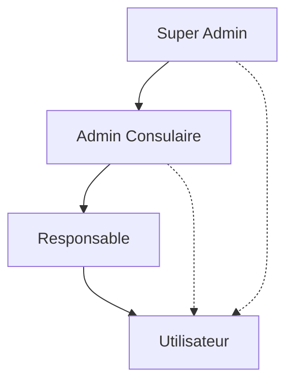
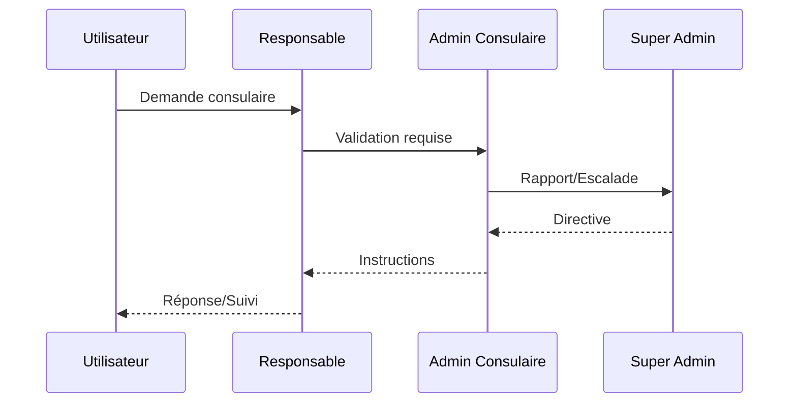

# Plan d'implémentation - Profils utilisateurs et IA

## 1. Architecture des profils

### 1.1 Types de profils
1. Super administrateur (Back Office)
2. Administratif Consulaire
3. Responsable (Sous-administrateur)
4. Utilisateur (Ressortissant)

### 1.2 Hiérarchie et relations

## 2. Plan d'implémentation par phases

### Phase 1: Base de données et modèles
- [x] Conception du schéma de base de données
    - Tables des utilisateurs avec différents rôles
    - Relations entre les profils
    - Stockage des données IA
- [x] Migration Prisma
- [x] Types TypeScript

### Phase 2: Authentification et autorisation
- [x] Système d'authentification Next-Auth
- [ ] Middleware de vérification des rôles
- [ ] Routes API protégées
- [ ] Pages protégées par rôle

### Phase 3: Interface utilisateur de base
- [ ] Composants UI réutilisables
- [ ] Layout par type de profil
- [ ] Navigation adaptative
- [ ] Formulaires de base

### Phase 4: Intégration IA
- [ ] Configuration de l'API Claude
- [ ] Middleware IA
- [ ] Système de contexte IA
- [ ] Intégration des prompts

### Phase 5: Fonctionnalités par profil

#### Super administrateur
- [ ] Dashboard analytique
- [ ] Gestion des consulats
- [ ] Supervision globale
- [ ] Rapports IA

#### Administratif Consulaire
- [ ] Gestion des demandes
- [ ] Validation documents
- [ ] Communication
- [ ] Assistance IA

#### Responsable
- [ ] Traitement demandes
- [ ] Support utilisateur
- [ ] Suivi dossiers
- [ ] IA conversationnelle

#### Utilisateur
- [ ] Profil personnel
- [ ] Demandes consulaires
- [ ] Messagerie
- [ ] Assistant IA

### Phase 6: Tests et optimisation
- [ ] Tests unitaires
- [ ] Tests d'intégration
- [ ] Tests de charge
- [ ] Optimisation des prompts IA

## 3. Interactions entre profils

### 3.1 Flux de communication

### 3.2 Flux de données
- Utilisateur → Système
    - Soumission documents
    - Informations personnelles
    - Demandes consulaires

- Système → IA
    - Analyse documents
    - Validation données
    - Génération réponses

- IA → Profils administratifs
    - Suggestions traitement
    - Alertes anomalies
    - Rapports analytiques

## 4. Intégration IA par profil

### Super administrateur
- Analyse prédictive des flux
- Détection des tendances
- Optimisation des ressources
- Surveillance intelligente

### Administratif Consulaire
- Validation automatisée documents
- Priorisation intelligente
- Réponses automatiques
- Analyse des performances

### Responsable
- Assistance traitement
- Support utilisateur IA
- Suggestions réponses
- Organisation intelligente

### Utilisateur
- Assistant personnel
- Auto-complétion formulaires
- Validation préalable
- Suggestions personnalisées

## 5. Points d'attention

### 5.1 Sécurité
- [ ] Chiffrement bout en bout
- [ ] Validation documents
- [ ] Protection données personnelles
- [ ] Traçabilité actions

### 5.2 Performance
- [ ] Optimisation requêtes
- [ ] Cache intelligent
- [ ] Lazy loading
- [ ] Pagination

### 5.3 UX/UI
- [ ] Interface intuitive
- [ ] Responsive design
- [ ] Accessibilité
- [ ] Multilingue

## 6. Maintenance et évolution

### 6.1 Monitoring
- [ ] Logs système
- [ ] Métriques IA
- [ ] Alertes
- [ ] Analytics

### 6.2 Mises à jour
- [ ] Base de connaissances IA
- [ ] Modèles IA
- [ ] Fonctionnalités
- [ ] Sécurité

## 7. Documentation

### 7.1 Technique
- [ ] API Reference
- [ ] Architecture système
- [ ] Intégration IA
- [ ] Sécurité

### 7.2 Utilisateur
- [ ] Guides par profil
- [ ] Tutoriels
- [ ] FAQ
- [ ] Support